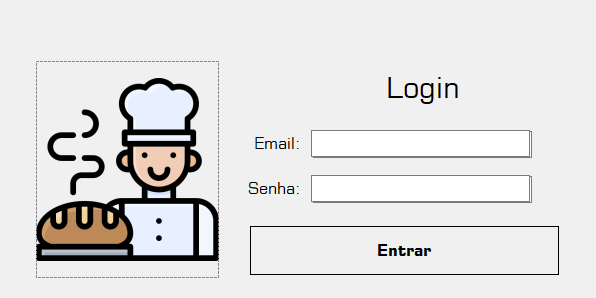
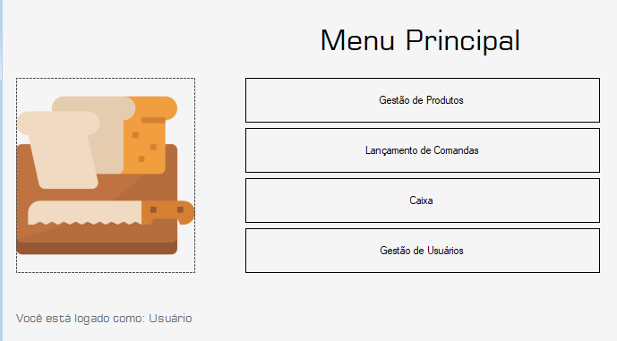
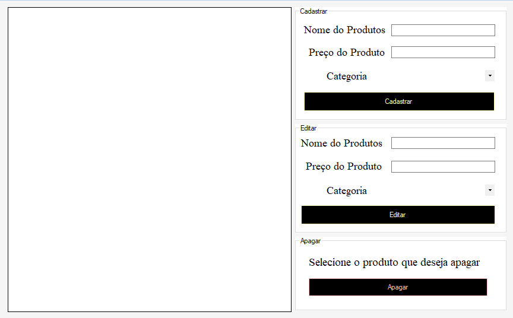
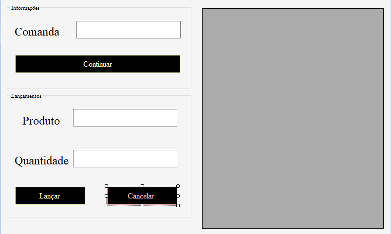
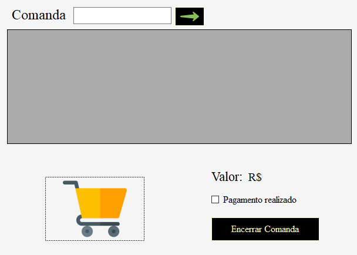
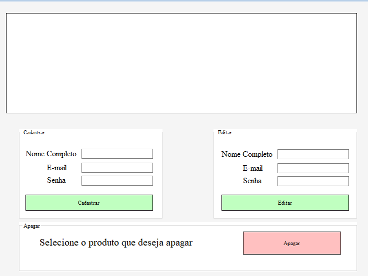

## Padarosa

O projeto Padaria é uma aplicação projetada para gerenciar operações de uma padaria, incluindo cadastro e edição de usuários, produtos, comandas e controle de caixa. A aplicação utiliza uma interface gráfica com formulários que permitem interagir com um banco de dados para armazenar e manipular informações de usuários, produtos e transações, oferecendo uma solução prática para o gerenciamento do negócio.Foi criado no Windows Forms desenvolvida em C# durante o curso Técnico em Desenvolvimento de Sistemas, em Pindamonhangaba.

## Funcionalidades

A aplicação permite o login de usuários com validação de e-mail e senha, exibindo um menu principal com acesso restrito para usuários comuns, onde apenas o administrador (ID 1) pode gerenciar usuários e produtos. É possível cadastrar, editar e remover usuários com campos para nome, e-mail e senha, exibidos em uma tabela interativa. O gerenciamento de produtos inclui cadastro e edição de nome, preço e categoria, com validações para evitar entradas inválidas, como números no nome do produto. A funcionalidade de comandas permite registrar produtos com quantidades e associá-los a uma comanda, enquanto o módulo de caixa possibilita consultar comandas por número, exibir o total de valores e encerrá-las após confirmação de pagamento, atualizando o banco de dados.
## Estrutura do Código

O projeto contém formulários Windows Forms. O formulário de login valida credenciais e redireciona para o menu principal, que exibe botões para acessar módulos de usuários, produtos, comandas e caixa, com restrições baseadas no ID do usuário. O formulário de gestão de usuários utiliza campos de texto para nome, e-mail e senha, uma tabela para exibir dados e botões para cadastrar, editar e apagar registros. O formulário de produtos inclui campos de texto para nome e preço, um combobox para categorias e uma tabela para listagem, com validações específicas para entrada de dados. O formulário de comandas permite selecionar produtos de uma tabela, inserir quantidades e associá-los a comandas, enquanto o formulário de caixa exibe comandas em uma tabela, calcula totais e habilita o encerramento com uma checkbox de confirmação de pagamento. A normalização de finais de linha é garantida por configurações no arquivo de controle de versão.

